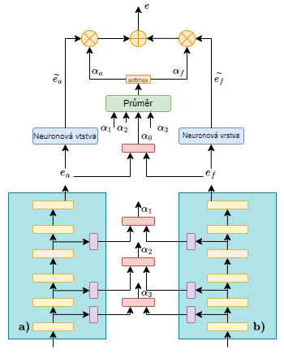
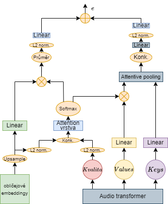

## Audiovisual Person Verification
You can find the full thesis with the "A" review [here](https://www.vut.cz/studenti/zav-prace/detail/153223).

This project explores the verification of an individual using audio-visual data, specifically combining facial images and voice recordings. The aim is to investigate methods for combining embeddings that represent a person’s identity from both audio and image modalities. A key objective is to develop a model that maintains strong verification capabilities even when one modality is degraded or corrupted.

Additionally, the project extends the verification process to video content, where the proposed models can assess the quality of different video segments and determine the reliability of each segment for person verification. A model is also designed to evaluate the quality of both modalities in video at each moment, enabling the system to dynamically allocate attention to the more reliable modality at any given point. This results in a robust verification system capable of handling noisy or incomplete input data.

## What I Did
In this project, I focused on generating robust person embeddings from both facial images and voice recordings using state-of-the-art models. For facial recognition, I employed the **InceptionResNet v4** model, while for voice recognition, I used **WavLM** paired with a **MultiHead-Factorized-Attentive-Pooling** backend, a powerful model for speaker embeddings.

To combine the embeddings from these two modalities, I experimented with multiple attention mechanisms. I implemented **soft attention**, **gated multimodal attention**, and soft attention for retrieving modality representations from **lower-levels** of encoders, allowing for dynamic weighting of face and voice features to ensure adaptability in noisy or incomplete data conditions.

Further, I extended these multimodal approaches to video content, exploring different methods to combine the modalities. I downloaded VoxCeleb videos from YouTube and extracted cropped face sequences. One novel contribution I made was the development of a technique for computing **quality attention** between every frame of the video and every frame output of the audio transformer, enabling a more nuanced integration of visual and audio cues across temporal frames in a video.

## Conclusion

The best models, using just one face image and 3 seconds of speech, achieved a **0.303% EER** on the VoxCeleb test set, compared to a **0.499% EER** when using a naive concatenation of embeddings.

For 3 seconds of video, I achieved a **0.159% EER** on a test subset of VoxCeleb that I managed to download.

## Note:
The files that start with `simple` or `video` are my scripts or scripts I modified (including utility scripts). Scripts starting with `simple` work with images, while those starting with `video` work with video (essentially sequences of images combined into a collage). 

This repository serves as a collection of the most important scripts used in the project, providing a practical view of the key components and models developed. It acts as a "dump" of the essential code.
